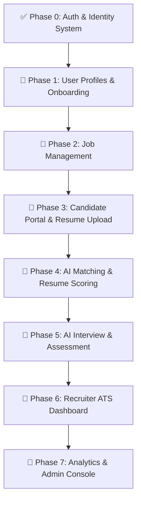

# 🤖 AI Recruitment Platform

An end-to-end, intelligent recruitment and applicant tracking platform powered by AI. Designed to streamline the hiring lifecycle—from candidate onboarding and job posting to automated resume parsing, AI match scoring, interactive screening interviews, and recruitment analytics.

---

## 🏗 System Architecture & Tech Stack

The solution follows **Clean Architecture** principles separating domain rules, application logic, infrastructure, and API layers.

```
AI Recruitment Platform
 ├── 🔹 backend/                     # .NET 8 Web API (Clean Architecture)
 │    ├── AiRecruitmentPlatform.Api          # Controllers, Swagger, Middlewares
 │    ├── AiRecruitmentPlatform.Application  # Use Cases, DTOs, CQRS/MediatR, Interfaces
 │    ├── AiRecruitmentPlatform.Domain       # Core Entities, Enums, Value Objects
 │    └── AiRecruitmentPlatform.Infrastructure # Database (EF Core), Identity, AI Services
 └── 🔸 frontend/                    # React + TypeScript Web Application
      └── src/
           ├── features/             # Feature-based modular structure
           │    ├── auth/            # Login, Register, OAuth
           │    ├── candidate/       # Candidate Profiles & Dashboard
           │    ├── company/         # Recruiter / Company Management
           │    ├── jobs/            # Job Postings & Search
           │    ├── resume/          # Resume Upload & Parsing
           │    ├── interviews/      # AI Candidate Assessment & Screening
           │    └── analytics/       # Hiring Pipeline Analytics
           └── store/                # State management (Zustand)
```

### **Technologies Used**
* **Backend**: .NET 9, ASP.NET Core Web API, Entity Framework Core, ASP.NET Core Identity (JWT & Google OAuth2).
* **Frontend**: React, TypeScript, Tailwind CSS / Modern CSS, Zustand, Axios / React Query.
* **AI Engine**: LLM (OpenAI / Gemini API), Resume Text Parsing, Vector Matching, Automated Q&A Evaluation.

---

## 🚦 Project Status & Execution Roadmap



### ✅ Phase 0: Authentication & Authorization *(Completed)*
- [x] User Registration & Login with ASP.NET Core Identity & JWT.
- [x] Google OAuth2 Authentication.
- [x] Role-Based Access Control (`Candidate`, `Recruiter`, `Admin`).
- [x] Refresh Token mechanism and secure auth state persistence in frontend.

--- 

### 🎯 Phase 1: User Profiles & Onboarding *(Completed)*
- [ ] **Candidate Profile System**:
  - Personal details, bio, experience level, expected salary, target roles.
  - Skills tagger, work history, education history, portfolio links.
- [ ] **Company / Recruiter Profile System**:
  - Company details (Name, Logo, Industry, Size, Website, Culture).
  - Recruiter team member management.
- [ ] **Onboarding Redirect Guard**:
  - Auto-routing new users to role-specific onboarding wizards upon first sign-in. 
---

### 📌 Phase 2: Job Management & Employer Portal *(Completed)*
- [ ] Job Post Creation Wizard (Role Title, Skills, Experience Level, Salary Range, Location, Remote Type).
- [ ] Customizable Screening Criteria (Mandatory skills, knock-out questions).
- [ ] Job Listing Lifecycle Management (Draft, Active, Paused, Closed).

---

### 📌 Phase 3: Candidate Portal & Resume Processing *(Completed)*
- [ ] Job Search & Discovery feed with multi-filter search (Skills, Location, Salary).
- [ ] Job Application Flow (One-Click Apply with profile vs Custom Upload).
- [ ] Document Storage integration (Local / AWS S3 / Azure Blob Storage) for resumes.

--- 

### 📌 Phase 4: AI Resume Parsing & Match Scoring Engine *(Completed)*
- [x] **AI Resume Parser**: Extract structured data (skills, experience years, education, certifications) from PDF/Word resumes.
- [x] **AI Match Engine**: Compute a **Match Percentage (%)** by evaluating Candidate Resumes against Job Requirements using LLM/Vector Embeddings.
- [x] Generate automated **Candidate Summary & Skill Gap Analysis**.

---

### 📌 Phase 5: AI Interview & Candidate Assessment System *(In Progress)*
- [ ] **Automated Screening Interviews**: AI-driven dynamic interview questions tailored to the job description and candidate resume.
- [ ] **Answer Evaluation Engine**: AI analyzes candidate text/audio/video responses for depth, correctness, and soft skills.
- [ ] **AI Scorecard**: Generate candidate evaluation summary for hiring managers.

---

### 📌 Phase 6: Recruiter ATS Dashboard & Pipeline
- [ ] **Interactive Hiring Pipeline (Kanban Board)**: Drag-and-drop candidates through stages (`Applied` ➔ `AI Screened` ➔ `Shortlisted` ➔ `Interview Scheduled` ➔ `Offered` ➔ `Rejected`).
- [ ] AI-Ranked Candidate List (Sorted by match score).
- [ ] Side-by-Side Candidate Comparison View.

---

### 📌 Phase 7: Analytics, Notifications & Administration
- [ ] **Real-time Notifications**: Email & In-app alerts for application status updates, interview invitations, and new matches.
- [ ] **Recruitment Analytics**: Time-to-hire, source effectiveness, applicant funnel metrics.
- [ ] **Admin Panel**: Platform user management, AI usage monitoring & token logs.

---

## 🛠 Local Setup & Running Instructions

### **Backend Setup (.NET 8)**
1. Navigate to the backend API project:
   ```bash
   cd backend/src/AiRecruitmentPlatform.Api
   ```
2. Update database connection string in `appsettings.json`.
3. Apply Entity Framework migrations & start server:
   ```bash
   dotnet ef database update
   dotnet run
   ```
4. Access Swagger UI at `https://localhost:7000/swagger` (or configured port).

### **Frontend Setup (React / TypeScript)**
1. Navigate to the frontend folder:
   ```bash
   cd frontend
   ```
2. Install dependencies and start the development server:
   ```bash
   npm install
   npm run dev
   ```
3. Open `http://localhost:5173` in your browser.

---

## 📄 License
Distributed under the MIT License. See `LICENSE` for details.
